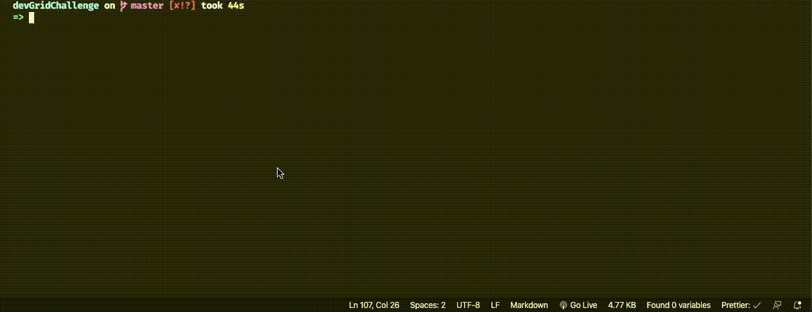

<div align="center">
  

</div>

<h2 align="center">
   Gist Scan
</h2>

<p align="center">

  

  

  

  

</p>

<blockquote align="center">
This project was developed as a technical test.
</blockquote>

<hr/>

<h3 align="center">Links:</h3>

<p align="center">

  <!-- <a href="#-sobre-esse-desafio">
    
  </a>&nbsp;&nbsp;
  <a href="#-requisitos">
    
  </a>&nbsp;&nbsp;
  <a href="#-especificacoes-tecnicas">
    
  </a>&nbsp;&nbsp;
  <a href="#-arquitetura">
    
  </a>&nbsp;&nbsp;
  <a href="#-sobre-a-api">
    
  </a>&nbsp;&nbsp;
  <a href="#-testes">
    
  </a>&nbsp;&nbsp;
  <a href="#-tecnologias-e-ferramentas">
    
  </a>&nbsp;&nbsp;
  <a href="#-executando-o-projeto">
    
  </a>&nbsp;&nbsp;

  <a href="#author-frederico-reis">
    
  </a> -->

#########

## 👀 Demo

<center >


</center >

## 💡 About this challenge:

On this project was developed a mobile app that allows users comment on Github Gist.

- The user must open the Gist trough a QRCode Scan

> More info about this challenge [here on original file](info.md)

## ⚙️ API:

The use of the Github GIST API is mandatory. You can access it through [the following link](https://developer.github.com/v3/gists/);

## 📚 Some used Libraries

- [lottie-react-native](https://github.com/react-native-community/lottie-react-native) => Used to render animations;
- [react-native-app-auth](https://github.com/FormidableLabs/react-native-app-auth) => Used to authenticate the user on Github;
- [react-native-qrcode-scanner](https://github.com/moaazsidat/react-native-qrcode-scanner) => Used to read QRCode with your smartphone camera;
- [react-native-syntax-highlighter](https://github.com/conorhastings/react-native-syntax-highlighter) => Used to render the Gist code;
- [react-native-vector-icons](https://github.com/oblador/react-native-vector-icons) => Used to render icons;
- [styled-components](https://styled-components.com/) => Used to create css styles;

## 🧪 Tests:

Implementation of unit tests in this project was started using
[Jest](https://jestjs.io/);

To run the tests just run the following command at the root of the project:

```bash
$ yarn test
```

The test details will be displayed on your console.



If you prefer, run the following command to generate the coverage folder

```bash
$ yarn test --coverage
```

## 🏁 Running the project:

1 - To run your project for the first time you will need to create a folder..

```bash
$ mkdir <your folder>
```

2 - Now enter the created folder.

```bash
$ cd <your folder>
```

3 - Let's clone the repository.

```bash
$ git clone https://github.com/Fred-Reis/gist-scan
```

4 - Run the following command to create the `node_modules` folder

```bash
$ yarn
```

5 - To install dependencies in IOS project using cocoa pods

```bash
$ cd ios

$ pod install
```

6 - Now, if you want to run this project on the emulator or device in development mode, run this command using your preferred platform.

```bash
$ yarn <your-preferred-platform>
```

7 - But if you wanna test on your Android device the .apk file is located at
`android/app/build/outputs/apk/release/app-release.apk`

<br/>

😃
If you got here it is a sign that everything went well and you can now scan your qrcode and comment on a gist. 🚀

<br/>

<h4 align="center">
  "Stay hungry stay foolish!"
</h4>

<br/>

---

<h3 align="center">
Author: <a alt="Fred-Reis" href="https://github.com/Fred-Reis">Frederico Reis</a>
</h3>

<p align="center">

  <a alt="Frederico Reis" href="https://www.linkedin.com/in/frederico-reis-dev/">
    </a>
  <a alt="Frederico Reis" href="https://github.com/Fred-Reis ">
  </a>

</p>

make with ♥️
